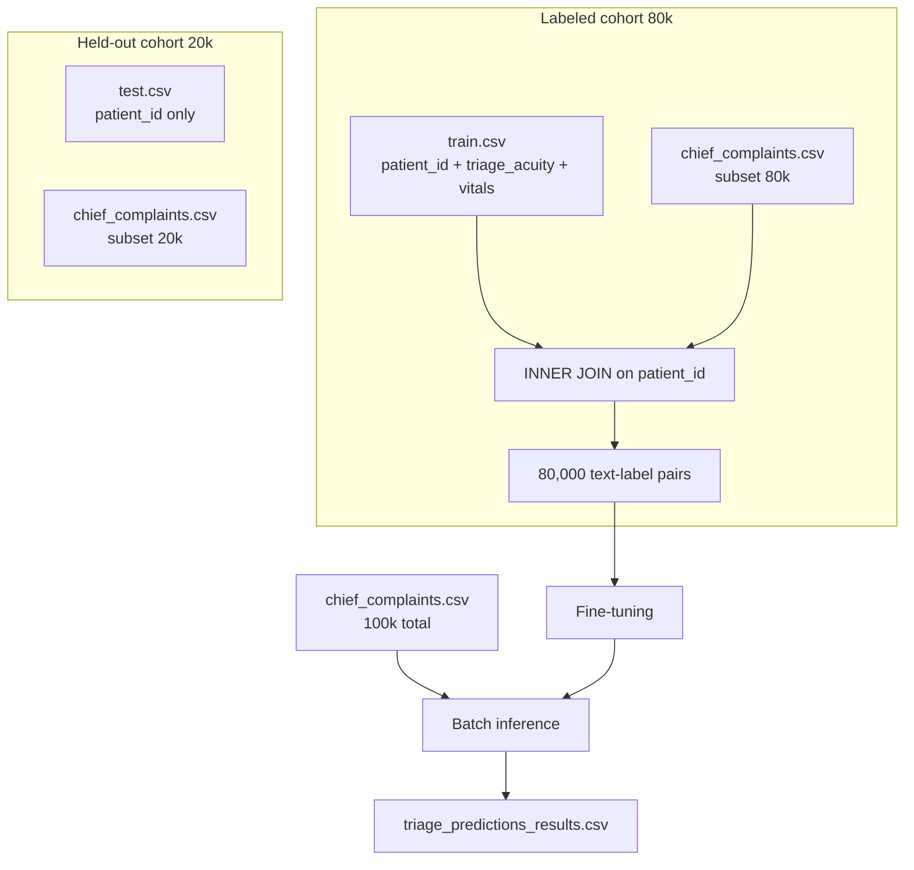
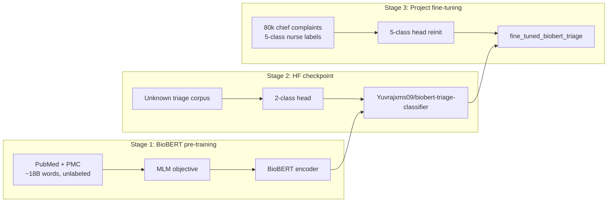

# Mathematical Data Engineering Analysis: BioBERT Triage Training Data

This document explains **what the triage training data is**, **how it is structured statistically**, and **how each data layer affects** the original BioBERT model and the project’s fine-tuning pipeline. It is written for a mathematically literate reader, with plain-language intuition alongside formulas.

**Sources:** `triage_new.ipynb`, `biobertStats.js`, `BioBERT Medical Triage Fine-Tuning Guide.md`, `predict.py`, `config.json`, and presentation materials in `slides_saturday/sections/03-biobert.tex`.

---

## Table of Contents

1. [Data Architecture Overview](#1-data-architecture-overview)
2. [Descriptive Statistics](#2-descriptive-statistics)
3. [Three-Stage Model Stack and Data at Each Stage](#3-three-stage-model-stack-and-data-at-each-stage)
4. [How Data Properties Affect Fine-Tuning](#4-how-data-properties-affect-fine-tuning)
5. [Worked Numerical Examples](#5-worked-numerical-examples)
6. [Summary: Data Feature → Model Effect](#6-summary-data-feature--model-effect)
7. [Limitations and Data Gaps](#7-limitations-and-data-gaps)

---

## 1. Data Architecture Overview

### 1.1 The four-file ecosystem

Machine learning for text classification requires every training row to contain both an **input** (what the model reads) and a **label** (the correct answer). In this project, those fields originally lived in separate CSV files and were joined before training.



| File | Rows | Role |
|------|------|------|
| `train.csv` | 80,000 | Nurse-assigned acuity labels, vitals, demographics, hospital logistics |
| `chief_complaints.csv` | 100,000 | Free-text chief complaint per patient |
| `test.csv` | 20,000 | Held-out patient IDs (competition-style evaluation set) |
| `triage_predictions_results.csv` | 100,000 | Model output after batch inference on all complaints |

**Population:** 100,000 unique patients (`patient_id` format: `TG-XXXXXXXXX`).  
**Labeled subset:** 80,000 patients appear in both `train.csv` and `chief_complaints.csv`.  
**Unlabeled subset:** ~20,000 patients have complaint text but no label in `train.csv` (aligned with `test.csv`).

### 1.2 File schemas

#### `train.csv` — structured clinical record

| Column group | Examples | Used in NLP training? |
|--------------|----------|----------------------|
| `patient_id` | `TG-UXRGA9UCO` | Yes (join key only) |
| `triage_acuity` | 1, 2, 3, 4, 5 | **Yes (target label)** |
| Vitals | Heart rate, blood pressure | **No — discarded** |
| Demographics | Age, sex | **No — discarded** |
| Logistics | Arrival mode, shift | **No — discarded** |

The acuity scale is **ordinal**: Level 1 = most urgent (Red/SATS), Level 5 = least urgent (Green). The model treats it as **single-label multi-class classification** (not ordinal regression).

#### `chief_complaints.csv` — raw text input

| Column | Description |
|--------|-------------|
| `patient_id` | Join key |
| `chief_complaint_raw` | Free-text symptom narrative, e.g. `"thunderclap headache, worsening with movement"` |

#### `test.csv` / `sample_submission.csv`

| Column | Description |
|--------|-------------|
| `patient_id` | Patient identifier |
| `triage_acuity` | Placeholder or submission target (all `3` in committed `sample_submission.csv`) |

### 1.3 The merge operation

Training begins with an **inner join** on `patient_id`:

```python
df = pd.merge(train_df, complaints_df, on="patient_id")
```

**Result:** 80,000 rows, each with `(chief_complaint_raw, triage_acuity)`.

**Preprocessing steps** (from `triage_new.ipynb`):

1. Drop rows with null text or null label: `dropna(subset=["chief_complaint_raw", "triage_acuity"])`
2. Cast text to string: `chief_complaint_raw.astype(str)`
3. Encode labels: `triage_acuity` → pandas `category` → integer codes 0–4
4. Keep only two columns for the model: `text` and `label`

**Label mapping detected at training time:**

```
{0: 1, 1: 2, 2: 3, 3: 4, 4: 5}
```

Internal index `k` (LABEL_k) maps to clinical acuity level `k + 1`.

### 1.4 Train / validation / test splits

There are **two independent split concepts**:

| Split | Size | Method | Used for? |
|-------|------|--------|-----------|
| **File-level** | 80k train / 20k test | By dataset design | Documented held-out cohort |
| **Notebook internal** | ~72k train / ~8k val | `train_test_split(test_size=0.1, seed=42)` | Gradient updates + early stopping |
| **`test.csv`** | 20,000 | — | **Never loaded in training code** |

The notebook does **not** stratify by class when creating the 90/10 split. Validation metrics reported during training (`eval_loss = 0.001812`) come from the random 10% holdout of the 80k labeled set, not from `test.csv`.

---

## 2. Descriptive Statistics

### 2.1 Class frequency table

The following distribution is from `biobertStats.js` (auto-generated from the training CSVs when they existed locally). It describes the **80,000 labeled rows** after merge.

| Level | Clinical meaning | Count \(n_k\) | Proportion \(p_k\) | Cumulative % |
|-------|------------------|---------------|-------------------|--------------|
| 1 | Most urgent (Red) | 3,222 | 0.0403 (4.03%) | 4.0% |
| 2 | Highly urgent (Orange) | 13,439 | 0.1680 (16.80%) | 20.8% |
| 3 | Moderate (Yellow) | 28,921 | 0.3615 (36.15%) | 57.0% |
| 4 | Less urgent (Green) | 23,020 | 0.2878 (28.78%) | 85.7% |
| 5 | Least urgent (Green) | 11,398 | 0.1425 (14.25%) | 100% |
| **Total** | — | **80,000** | **1.000** | — |

**Sample size:** \(N = 80{,}000\).

### 2.2 Central tendency and baselines

| Measure | Value | Interpretation |
|---------|-------|----------------|
| **Mode (majority class)** | Level 3 | Most frequent single label |
| **Majority-class baseline accuracy** | 36.15% | Accuracy if the model always predicts Level 3 |
| **Minority class** | Level 1 (3,222 cases) | Rarest but clinically most critical |
| **Imbalance ratio** \(n_3 / n_1\) | **8.98 ≈ 9:1** | Majority class has ~9× more samples than minority |

A naive classifier that always outputs Level 3 would be correct more than one-third of the time — but would **miss every Level 1 and Level 2 case**, which are the patients who need immediate attention.

### 2.3 Shannon entropy (label uncertainty)

Entropy measures how "spread out" the class distribution is. For a discrete distribution \(\{p_1, \ldots, p_K\}\):

\[
H = -\sum_{k=1}^{K} p_k \log_2 p_k
\]

| Quantity | Value |
|----------|-------|
| Observed entropy \(H\) | **2.067 bits** |
| Maximum entropy (uniform 5 classes) | \(\log_2 5 \approx 2.322\) bits |
| **Normalized entropy** \(H / \log_2 K\) | **0.890** |

**Interpretation:** The labels are **moderately imbalanced** — not uniform (which would give \(H = 2.32\)), but not collapsed to a single class (which would give \(H = 0\)). Roughly 89% of the maximum possible label diversity remains.

### 2.4 Gini impurity

Gini impurity is familiar from decision trees and measures how often a random label draw would be "wrong" if we guessed the majority class:

\[
G = 1 - \sum_{k=1}^{K} p_k^2
\]

| Quantity | Value |
|----------|-------|
| Gini impurity | **0.736** |
| Minimum (pure node) | 0 |
| Maximum (uniform 5 classes) | \(1 - 5 \times (0.2)^2 = 0.80\) |

**Interpretation:** High impurity (0.736 out of 0.80 max) confirms the labels are spread across classes — the classification task is non-trivial.

### 2.5 Expected validation set composition

With a random 10% split (\(N_{\text{val}} \approx 8{,}000\)) and **no stratification**, expected counts per class follow a binomial distribution \(\text{Bin}(8000, p_k)\):

| Level | Expected count \(E[n_k]\) | Std. dev. \(\sigma_k = \sqrt{N_{\text{val}} \cdot p_k (1-p_k)}\) |
|-------|---------------------------|------------------------------------------------------------------|
| 1 | 322.2 | 17.6 |
| 2 | 1,344.0 | 33.3 |
| 3 | 2,892.0 | 43.0 |
| 4 | 2,302.0 | 40.5 |
| 5 | 1,139.8 | 31.3 |

**Risk:** In any single random split, Level 1 may appear only ~300 times in validation. With so few examples, per-class recall for the rarest class is **statistically noisy** — a difference of ±20 Level-1 cases changes recall by several percentage points.

### 2.6 Text variable properties

Raw CSVs are not committed to the repository, so the following is qualitative (from documentation and example rows in `biobertStats.js`):

| Property | Description | Statistical implication |
|----------|-------------|------------------------|
| **Length** | Short free-text phrases (typically one sentence) | Most complaints likely fit within 128 tokens |
| **Style** | Informal hospital phrasing | Domain shift vs. formal PubMed prose |
| **Vocabulary** | Medical + lay terms mixed | BioBERT WordPiece vocab (28,996 tokens) covers most terms |
| **Tokenization** | WordPiece, `max_length=128`, truncation | Long complaints lose tail tokens (right-censoring) |
| **Missing text** | Dropped at `dropna` | Exact drop count unknown without CSVs |

**Example complaints from the dataset:**

| Patient | Complaint | True label |
|---------|-----------|------------|
| TG-UXRGA9UCO | thunderclap headache, worsening with movement | Level 2 |
| TG-B19DBBS2G | contraception advice, intermittent | Level 5 |
| TG-7OKLDLKAQ | acute angle closure glaucoma in known patient | Level 2 |

---

## 3. Three-Stage Model Stack and Data at Each Stage

The deployed model is not trained from scratch on hospital data. It is the end product of **three sequential training phases**, each fed by different data with different objectives.



### 3.1 Stage 1 — Original BioBERT (PubMed / PMC)

| Aspect | Detail |
|--------|--------|
| **Data** | PubMed abstracts (~4.5B words) + PMC full text (~13.5B words) |
| **Labels** | None — unsupervised / self-supervised |
| **Objective** | Masked Language Modeling (MLM) |
| **Architecture** | BERT-Base: 12 layers, 768 hidden dim, 12 attention heads |

**Loss function:**

\[
\mathcal{L}_{\text{MLM}} = -\sum_{i \in \mathcal{M}} \log P(t_i \mid H^{(L)}; \theta)
\]

where \(\mathcal{M}\) is the set of masked token positions, \(H^{(L)}\) is the final hidden state, and \(\theta\) are model parameters.

**What the data teaches:**
- Medical vocabulary (anatomy, drugs, pathophysiology)
- Syntactic patterns of scientific English
- Token co-occurrence (e.g. "chest" near "pain", "hyper-" vs "hypo-")

**What the data does NOT teach:**
- Triage urgency, SATS colours, or ordinal acuity
- Short informal chief-complaint phrasing
- Hospital-specific workflows or nurse judgement patterns

**Effect on later stages:** The encoder weights become a **medical language prior** — a strong initialization for any downstream biomedical NLP task.

### 3.2 Stage 2 — Intermediate checkpoint (`Yuvrajxms09/biobert-triage-classifier`)

| Aspect | Detail |
|--------|--------|
| **Data** | Unknown external triage corpus (not in this repository) |
| **Labels** | Binary or coarse urgency (2 classes) |
| **Objective** | Cross-entropy classification |
| **Architecture** | BioBERT encoder + 2-output linear head |

**Classification head (before your fine-tuning):**

\[
\hat{\mathbf{y}} = \text{softmax}(W h_{[\text{CLS}]} + \mathbf{b}), \quad W \in \mathbb{R}^{2 \times 768},\; \mathbf{b} \in \mathbb{R}^{2}
\]

**What this stage contributes:**
- Encoder weights partially adapted to **triage-relevant text patterns**
- The model has already learned to map symptom language to urgency-like decisions

**Critical mismatch with your data:**

When loading for fine-tuning, the notebook reports:

```
classifier.weight | MISMATCH | ckpt: [2, 768] → model: [5, 768]
classifier.bias   | MISMATCH | ckpt: [2]     → model: [5]
```

The 2-class head is **discarded and randomly reinitialized** (`ignore_mismatched_sizes=True`). Only the **encoder** carries forward learned knowledge; the output layer starts from scratch for 5 classes.

### 3.3 Stage 3 — Project fine-tuning (hospital chief complaints)

| Aspect | Detail |
|--------|--------|
| **Data** | 80,000 `(chief_complaint_raw, triage_acuity)` pairs |
| **Labels** | 5-class nurse-assigned acuity (levels 1–5) |
| **Objective** | Multi-class cross-entropy |
| **Base checkpoint** | `Yuvrajxms09/biobert-triage-classifier` |

**Loss function:**

\[
\mathcal{L} = -\frac{1}{N} \sum_{i=1}^{N} \log P(y_i \mid X_i; \theta)
\]

where \(X_i\) is the tokenized chief complaint, \(y_i \in \{0,1,2,3,4\}\) is the integer label, and \(P(y_i \mid X_i)\) is the softmax probability for the true class.

**Softmax output:**

\[
\hat{y}_c = P(\text{acuity} = c \mid X) = \frac{e^{z_c}}{\sum_{j=1}^{5} e^{z_j}}, \quad z_c = (W h_{[\text{CLS}]} + b)_c
\]

**Training hyperparameters:**

| Setting | Value |
|---------|-------|
| Epochs | 3 |
| Batch size | 16 (train and eval) |
| Learning rate | 2×10⁻⁵ |
| Weight decay | 0.01 |
| Max sequence length | 128 tokens |
| Optimizer steps | 13,500 total (3 × 4,500 steps/epoch) |
| FP16 | Enabled |
| Best validation loss | **0.001812** (epoch 3) |

**Training volume per sample:** Each of the ~72,000 training rows is seen approximately **3 times** (3 epochs). Each of the 80,000 labeled rows contributes to learning, but only 90% per epoch due to the holdout split.

**What changes vs. what is frozen:**

| Component | Initialization | Updated during fine-tuning? |
|-----------|----------------|----------------------------|
| Embedding layers | BioBERT + checkpoint | Yes (small LR updates) |
| 12 transformer layers | BioBERT + checkpoint | Yes |
| Classifier head \(W, b\) | **Random** (5×768) | Yes (learns from scratch) |

---

## 4. How Data Properties Affect Fine-Tuning

This section connects specific data characteristics to their mathematical and clinical consequences for model behaviour.

### 4.1 Class imbalance → gradient dominance

Training uses **uniform random sampling** without class weights, oversampling, or stratification.

**Expected mini-batch composition** (batch size \(B = 16\)):

| Level | \(p_k\) | Expected count per batch \(B \cdot p_k\) |
|-------|---------|------------------------------------------|
| 1 | 0.0403 | 0.64 |
| 2 | 0.1680 | 2.69 |
| 3 | 0.3615 | 5.78 |
| 4 | 0.2878 | 4.60 |
| 5 | 0.1425 | 2.28 |

**Consequences:**

1. **Gradient dominance:** Levels 3 and 4 together account for ~65% of every epoch’s samples. The loss gradient \(\nabla_\theta \mathcal{L}\) is dominated by common-class errors. The optimizer prioritizes reducing mistakes on Level 3/4 over Level 1/2.

2. **Minority class exposure:** Level 1 appears in roughly **64 mini-batches per epoch** (3,222 samples / 16 batch size ≈ 201 batches containing at least one Level-1 case, but many batches have zero). Level 3 appears in **~1,808 batches worth** of samples per epoch.

3. **No mitigation:** The notebook does not use `class_weight`, focal loss, oversampling, SMOTE, or stratified splitting. Imbalance is handled downstream by the **fusion system** (TEWS + Bayesian fallback), not during training.

4. **Clinical risk asymmetry:** A false negative on Level 1 (predicting Green for a Red patient) is far more dangerous than a false positive on Level 5 — but cross-entropy treats all misclassifications with equal structural penalty (modulo class frequency in the gradient).

### 4.2 Discarding vitals → information bottleneck

`train.csv` contains vitals (heart rate, blood pressure), demographics (age, sex), and logistics (arrival mode, shift). **All are dropped** before training. The model sees only `chief_complaint_raw`.

**Information-theoretic view:**

Let \(Y\) = true acuity, \(T\) = text, \(V\) = vitals. The full data provides \(I(Y;\, T, V)\) — mutual information between labels and both modalities. Training on text alone captures only \(I(Y;\, T)\).

When \(I(Y;\, V \mid T) > 0\) — vitals carry urgency information beyond the text — discarding \(V\) introduces **label noise**:

\[
P(Y \mid T) \neq P(Y \mid T, V)
\]

**Example:** Two patients with complaint "chest pain" may receive different acuity levels because one has HR 120 and BP 90/60 while the other has normal vitals. The model must learn an **average** mapping from "chest pain" to some compromise acuity, increasing output uncertainty.

**System design implication:** This is why Curatio uses **TEWS** (vital-sign scoring) and **Bayesian fusion** alongside BioBERT — each modality covers information the others lack.

### 4.3 Domain shift (PubMed → ED chief complaints)

| Dimension | Pre-training data (PubMed/PMC) | Fine-tuning data (chief complaints) |
|-----------|-------------------------------|--------------------------------------|
| Register | Formal scientific prose | Informal, terse clinical notes |
| Sentence length | Long, complex | Short phrases, comma-separated symptoms |
| Vocabulary | Latin terms, abbreviations in context | Lay + medical mix, local phrasing |
| Label signal | None (unsupervised) | 5-level nurse judgement |

**Transfer learning** bridges this gap: the encoder already understands "glaucoma", "headache", "thunderclap" from PubMed. Fine-tuning adjusts decision boundaries for urgency.

**Residual risk:** Rare ED-specific phrases with no PubMed analogue receive **weaker embeddings** and higher prediction variance. This manifests as lower softmax confidence — the 361 borderline cases (0.6–0.99 confidence) in the inference output.

### 4.4 Sequence length truncation (128 tokens)

BERT supports up to 512 positions; this project uses `max_length=128`.

**Truncation rule:** If a complaint tokenizes to more than 128 WordPiece tokens, tokens beyond position 128 are **discarded** (right truncation by default in Hugging Face).

**Statistical effect:** The text length distribution is **right-censored** at 128 tokens. Severity cues appearing late in long narratives are invisible to the model. For the predominantly short chief complaints in this dataset, truncation likely affects a small fraction of rows — but without the CSVs, the exact proportion is unknown.

**Information loss bound:** If \(L\) = true token length and \(L > 128\), the model conditions on only the first 128 tokens: \(P(Y \mid t_1, \ldots, t_{128}) \neq P(Y \mid t_1, \ldots, t_L)\).

### 4.5 Split methodology and statistical validity

| Concern | Detail |
|---------|--------|
| **Non-stratified validation** | Random 10% split may under- or over-represent Level 1 by ±18 cases (1σ). Validation loss is not a reliable proxy for minority-class recall. |
| **`test.csv` unused** | The 20k held-out file is never evaluated in code. No unbiased estimate of generalization to the full 100k population exists in the pipeline. |
| **Low `eval_loss`** | Best validation cross-entropy = 0.001812 nats. A majority-class classifier achieves CE ≈ \(-\log(0.3615) \approx 1.018\) nats. The fine-tuned model’s loss is ~500× lower — suggesting strong fit, but possibly **overconfidence** on training distribution. |
| **No classification metrics** | No accuracy, precision, recall, F1, Cohen’s κ, or confusion matrix is computed. Cross-entropy alone does not reveal per-class clinical safety. |
| **Training loss << validation loss (epoch 1)** | Train loss 0.000080 vs. val loss 0.002411 suggests the model fits training batches extremely tightly from epoch 1 — a mild overfitting signal, though val loss still improves through epoch 3. |

**Epoch-by-epoch training dynamics:**

| Epoch | Training Loss | Validation Loss |
|-------|---------------|-----------------|
| 1 | 0.000080 | 0.002411 |
| 2 | 0.000292 | 0.002414 |
| 3 | 0.000016 | **0.001812** |

### 4.6 Confidence distribution (post-inference)

After fine-tuning, batch inference was run on all **100,000** chief complaints. Summary statistics from `biobertStats.js`:

| Metric | Value |
|--------|-------|
| Total predictions | 100,000 |
| Confidence = 1.0 (softmax max) | **99.6%** |
| Confidence in 0.6–0.99 range | **361 rows (0.36%)** |
| Deployment threshold \(\tau\) | 0.85 (`predict.py`) |

**Confidence definition:**

\[
\text{confidence} = \max_{c} \hat{y}_c = \max_{c} P(\text{acuity} = c \mid X)
\]

**Interpretation:**

- The model is **extremely decisive** — for 99.6% of cases, essentially all probability mass sits on one class.
- Only 0.36% of predictions are ambiguous enough to trigger Bayesian fallback (`confidence < 0.85`).
- **Caution:** Softmax outputs are not calibrated probabilities. On imbalanced data, neural networks commonly exhibit **overconfidence** — assigning probability ≈ 1.0 even when wrong. High confidence does not guarantee clinical correctness. Presentation materials explicitly note: *"Some urgent cases are overconfidently misclassified — fusion with TEWS/Bayesian mitigates this."*

**Output entropy** (for a nearly one-hot prediction with confidence 0.996):

\[
H_{\text{out}} = -\sum_c \hat{y}_c \log_2 \hat{y}_c \approx 0.03 \text{ bits}
\]

For a borderline case (e.g. 0.854 on Level 2, 0.141 on Level 3):

\[
H_{\text{out}} \approx 0.69 \text{ bits}
\]

Higher output entropy correlates with cases where the fusion system should intervene.

---

## 5. Worked Numerical Examples

### 5.1 Cross-entropy penalty

For a single sample with true class \(y\) and predicted probability \(\hat{y}_y\) for the correct class:

\[
\ell = -\log(\hat{y}_y)
\]

| Scenario | \(\hat{y}_y\) | Loss \(\ell\) | Interpretation |
|----------|---------------|---------------|----------------|
| Correct, confident | 0.97 | 0.030 | Low penalty — model rewarded |
| Correct, uncertain | 0.60 | 0.511 | Moderate penalty |
| Wrong, confident (predicted 0.94 for wrong class) | 0.06 | **2.81** | Severe penalty for true class |
| Majority-class shortcut (always predict Level 3) | 0.3615 | 1.018 | Beats random (1.61) but clinically unsafe |

**Example from training data:**  
Complaint: `"contraception advice, intermittent"` → true label Level 5.  
If the model assigns \(P(\text{Level 5}) = 0.97\): loss \(= -\log(0.97) \approx 0.030\).

### 5.2 High-confidence urgent case

| Field | Value |
|-------|-------|
| Patient | TG-UXRGA9UCO |
| Complaint | thunderclap headache, worsening with movement |
| True label | Level 2 (Orange) |
| Predicted | Level 2 |
| Confidence | 1.00 |

The softmax distribution is approximately \([0.01, 0.94, 0.03, 0.01, 0.01]\). Output entropy \(\approx 0.35\) bits — very low. The model passes the \(\tau = 0.85\) gate; no Bayesian fallback.

**Why it works:** "Thunderclap headache" is strong medical terminology well-represented in PubMed. Fine-tuning maps it to high urgency.

### 5.3 Borderline case (Bayesian candidate)

| Field | Value |
|-------|-------|
| Patient | TG-7OKLDLKAQ |
| Complaint | acute angle closure glaucoma in known patient |
| Predicted | Level 2 |
| Confidence | 0.854 |

Approximate distribution: Level 2 ≈ 85.4%, Level 3 ≈ 14.1%. Output entropy \(\approx 0.69\) bits. Confidence is just below \(\tau = 0.85\) → `bayesian_candidate = True` in `predict.py`.

**Why it is ambiguous:** Ophthalmologic emergencies occupy a border zone between Level 2 (high urgency) and Level 3 (moderate). Without vitals, the text alone does not fully resolve acuity.

### 5.4 Majority-class shortcut

A model that **always predicts Level 3**:

| Metric | Value |
|--------|-------|
| Accuracy | 36.15% |
| Level 1 recall | 0% |
| Level 2 recall | 0% |
| Level 5 recall | 0% |
| Cross-entropy | 1.018 nats |

This achieves better-than-random accuracy (20% for uniform 5-class) but is **clinically catastrophic** — every Red and Orange patient is misrouted. The imbalanced data makes this shortcut tempting for loss minimization if the model underfits minority classes.

---

## 6. Summary: Data Feature → Model Effect

| Data property | Effect on base BioBERT (Stages 1–2) | Effect on fine-tuning (Stage 3) |
|---------------|--------------------------------------|----------------------------------|
| Unlabeled PubMed text (~18B words) | Learns medical language via MLM | Provides encoder initialization |
| 2-class prior checkpoint | Partial triage adaptation of encoder | Warm-start; classifier head discarded and reinitialized |
| 5-class imbalanced labels (4%–36% per class) | N/A | Gradient bias toward Levels 3–4; minority under-learning |
| Text-only input (vitals discarded) | N/A | Label noise; identical text → different true acuity possible |
| Short complaints (≤128 tokens) | N/A | Full textual signal available to model |
| Long complaints (>128 tokens) | N/A | Tail truncation → potential information loss |
| 80,000 sample size | N/A | Adequate for BERT-base fine-tuning; 3 epochs ≈ 3 passes per sample |
| Random 90/10 split (no stratification) | N/A | Validation metrics unreliable for rare classes |
| 20k `test.csv` held out | N/A | Never evaluated — no unbiased generalization estimate |
| Nurse-assigned ordinal labels | N/A | Treated as nominal classes; ordinal structure unused |
| Informal ED phrasing | N/A | Domain shift from PubMed; transfer learning required |
| No class weights / augmentation | N/A | Raw imbalance flows directly into loss landscape |

---

## 7. Limitations and Data Gaps

### 7.1 Missing raw data files

The primary CSVs are **not in the git repository**:

- `train.csv` (80,000 rows)
- `chief_complaints.csv` (100,000 rows)
- `test.csv` (20,000 rows)
- `triage_predictions_results.csv` (100,000 rows)

Only `csv files/sample_submission.csv` (20,000 placeholder rows, all `triage_acuity = 3`) is committed. All statistics in this document come from `biobertStats.js`, which was auto-generated when the CSVs existed locally, and from notebook execution outputs.

**Recommendation:** If CSVs are recovered from Google Drive (`/content/drive/MyDrive/fine_tuned_biobert_triage/`), re-run exploratory analysis: text length histograms, vocabulary coverage, missing-value rates, and per-class validation confusion matrices.

### 7.2 Ambiguous data provenance

Documentation refers to "KATH-style" hospital records (Komfo Anokye Teaching Hospital, Kumasi, Ghana). Patient IDs use a `TG-*` format suggestive of a competition or synthetic dataset. No data-generation script exists in the repository. The analysis here describes the **statistical structure** of the data as used, without claiming verified real-world provenance.

### 7.3 Uncomputed analyses

The following would strengthen the statistical picture but are not available without the CSVs or additional evaluation code:

| Analysis | Status |
|----------|--------|
| Text length distribution (tokens) | Not computed |
| Word frequency / TF-IDF by class | Not computed |
| Vocabulary coverage (% OOV tokens) | Not computed |
| Missing value rates per column | Not computed |
| Confusion matrix on validation set | Not computed |
| Per-class precision, recall, F1 | Not computed |
| Evaluation on `test.csv` (20k held-out) | Not performed |
| Calibration plot (confidence vs. accuracy) | Not performed |
| Cohen’s κ (inter-rater / model vs. nurse) | Not computed |

### 7.4 What this document does not change

This is a **read-only analysis**. No training code, notebooks, model weights, or evaluation pipelines were modified. To act on the findings (e.g. stratified splits, class weights, ordinal loss, vitals fusion at training time), separate implementation work would be required.

---

## Appendix: Key File References

| File | Role |
|------|------|
| `fine-tuned-biobert/triage_new.ipynb` | Data merge, tokenization, training, inference |
| `curatio/client/src/data/biobertStats.js` | Class distribution, confidence stats, examples |
| `fine-tuned-biobert/BioBERT Medical Triage Fine-Tuning Guide.md` | Data schema narrative |
| `curatio/server/ml/predict.py` | Production inference, label mapping, confidence threshold |
| `fine-tuned-biobert/fine_tuned_biobert_triage-.../config.json` | 5-class model configuration |
| `slides_saturday/sections/03-biobert.tex` | Loss functions, training settings, data exploration slides |

---

*Generated as part of the Curatio / Final Year Project BioBERT triage analysis.*
