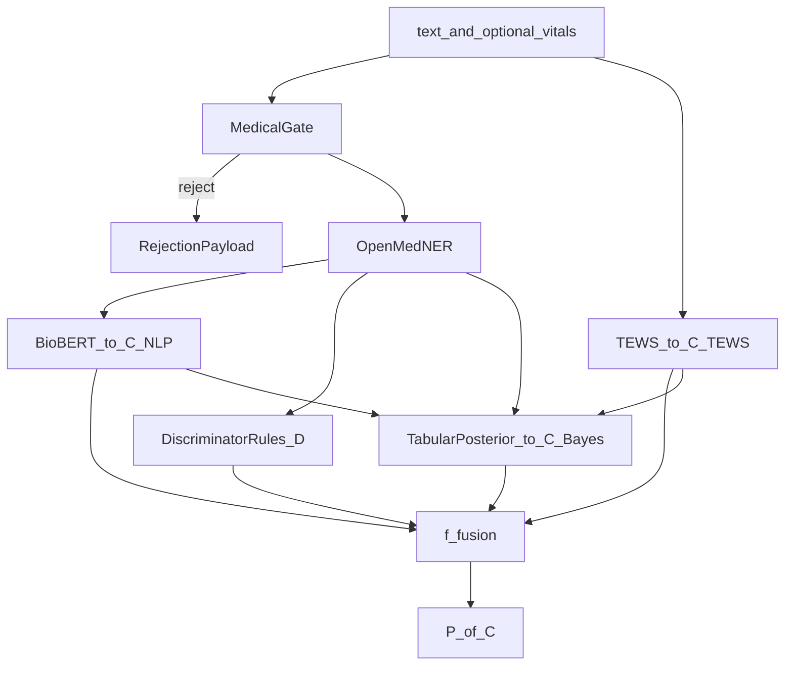

# 01 — Architecture

End-to-end design for Part 2: multi-signal triage fusion and colour-coded clinical pathways.

---

## Pipeline overview



**Session state** (for audit / thesis notation):

\[
\mathbf{S}_s = (X,\, \mathbf{D},\, T,\, \mathbf{P},\, C,\, \text{flags})
\]

Layer functions:

\[
\mathbf{D} = f_{\mathrm{disc}}(X, \text{entities}),\quad
T = f_{\mathrm{TEWS}}(\mathbf{v}),\quad
\mathbf{P} = \text{posterior table lookup},\quad
C = f_{\mathrm{fusion}}(\mathbf{D}, T, \mathbf{P}, \text{flags})
\]

---

## Current vs target

### Today (`POST /predict`)

```
X → gate → OpenMed → BioBERT → softmax → acuity ĉ → C_NLP = f_SATS(ĉ)
```

Implemented in [`predict.py`](../curatio/server/ml/predict.py). Colour mapping:

| Acuity ĉ | \(C_{\mathrm{NLP}}\) |
|----------|----------------------|
| 1 | Red |
| 2 | Orange |
| 3 | Yellow |
| 4, 5 | Green |

### Target (`POST /fuse`)

```
X, v → [parallel layers] → f_fusion → C → P(C)
```

Orchestrator: future `fuse.py`. Calls existing `predict()` for NLP layer, then adds vitals-based and rule-based layers.

---

## Module map (future code)

| Module | File | Inputs | Output |
|--------|------|--------|--------|
| NLP acuity | `predict.py` (existing) | \(X\), gate, openmed | \(C_{\mathrm{NLP}}\), confidence, entities |
| TEWS | `tews.py` | \(\mathbf{v}\) | \(T\), \(C_{\mathrm{TEWS}}\), `tews_incomplete` |
| Discriminators | `discriminators.py` | \(X\), OpenMed entities | \(\mathbf{D}\), \(C_{\mathrm{disc}}\) |
| Tabular Bayes | `bayes_fallback.py` | \(E\), scenario key | \(C_{\mathrm{Bayes}}\), \(\mathbf{P}\), posteriors |
| Fusion | `fusion.py` | layer colours + flags | \(C\), audit, flags |
| Pathways | `pathways.py` | \(C\) | \(P(C)\) |
| Orchestrator | `fuse.py` | request body | full fused response |

---

## Integration points

### ML API — [`app.py`](../curatio/server/ml/app.py)

Add:

- `POST /fuse` — new entry point (see [07-api-contract.md](07-api-contract.md))
- Keep `POST /predict` unchanged

### Express gateway — [`triage.js`](../curatio/server/routes/triage.js)

Add `POST /api/triage/fuse` proxy mirroring predict proxy pattern (gate/openmed query params).

### React client — [`TriageTestPage.jsx`](../curatio/client/src/pages/test/TriageTestPage.jsx)

- Optional vitals form (HR, RR, temp, mobility, AVPU, trauma)
- Pathway card rendered from fused \(C\), not NLP-only
- Audit panel showing layer votes: \(C_{\mathrm{NLP}}\), \(C_{\mathrm{TEWS}}\), \(C_{\mathrm{disc}}\), \(C_{\mathrm{Bayes}}\)

### Pathway copy — [`acuityLevels.js`](../curatio/client/src/data/acuityLevels.js)

Source text for \(P(C)\) fields. Server-side `pathways.py` should mirror the same levels/times/meanings.

---

## Parallel execution model

Layers that can run after gate passes:

| Layer | Depends on | Can run in parallel with |
|-------|------------|--------------------------|
| BioBERT / \(C_{\mathrm{NLP}}\) | gate, OpenMed | TEWS (if vitals present) |
| Discriminators | \(X\), entities | TEWS, BioBERT |
| TEWS | \(\mathbf{v}\) | BioBERT, discriminators |
| Bayes fallback | \(E\) from entities + vitals + NLP confidence | After partial inputs known |

`fuse.py` should:

1. Run gate (reject early if non-medical)
2. Fetch OpenMed entities once
3. Run `predict()` (or inline BioBERT if sharing entities)
4. Run `discriminators`, `tews`, and conditionally `bayes_fallback`
5. Call `fusion.fuse(...)` then `pathways.lookup(C)`

---

## Flags (session metadata)

| Flag | Set when | Effect on fusion |
|------|----------|------------------|
| `tews_incomplete` | Any of 6 vitals missing | Do not assign Green on TEWS alone; may invoke Bayes |
| `low_nlp_confidence` | confidence \(< \tau\) (default 0.85) | Invoke Bayes fallback |
| `layer_conflict` | \(\mathrm{ord}(C_{\mathrm{NLP}}) \neq \mathrm{ord}(C_{\mathrm{TEWS}})\) and both present | Invoke Bayes; audit conflict |
| `bayes_invoked` | Bayes module ran | Include posteriors in audit |
| `discriminator_override` | \(C_{\mathrm{disc}}\) strictly more urgent than TEWS | Audit reason |

---

## Backward compatibility

- `/predict` continues to return current JSON (no vitals, no fusion)
- `/fuse` adds `fused_colour`, `pathway`, `layers`, `flags`, `audit`
- Clients that only need NLP can keep using `/predict`

---

## Related docs

- TEWS detail: [02-tews-calculator.md](02-tews-calculator.md)
- Discriminators: [03-discriminators.md](03-discriminators.md)
- Bayes tables: [04-bayesian-fallback.md](04-bayesian-fallback.md)
- Fusion rules: [05-fusion-engine.md](05-fusion-engine.md)
- Pathways: [06-pathways.md](06-pathways.md)
